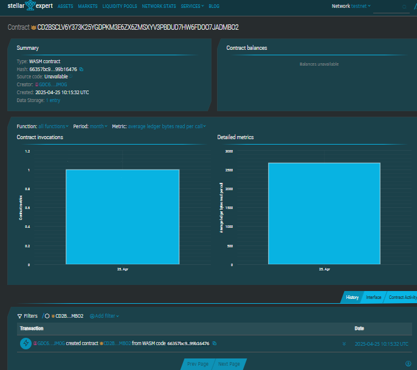

# Photo Editing App with AI Filters

## Project Description

A blockchain-integrated photo editing platform that empowers users to enhance their photos using AI-powered filters. Each filter application is logged immutably on-chain, offering transparent and verifiable history of photo enhancements.

## Project Vision

To combine the power of AI and decentralized technology to give users more control and transparency over their digital creations. By recording filter applications on the blockchain, we aim to create a trusted, tamper-proof audit trail of photo edits.

## Key Features

- **Apply AI Filter**: Users can apply AI-based filters to photos. Each application is logged on the blockchain.
- **View Filtered Photo Info**: Retrieve filter application details for any photo using its unique photo ID.
- **Track Total Filters Applied**: Monitor the number of filter edits made across the platform.

## Future Scope

- **NFT Integration**: Mint filtered photos as NFTs to establish ownership and provenance.
- **Filter Marketplace**: Allow third-party developers to submit and monetize custom AI filters.
- **Social Features**: Enable users to share filter effects and vote on the best edits.
- **Decentralized Storage**: Store and reference the actual photo data using IPFS or similar services.

